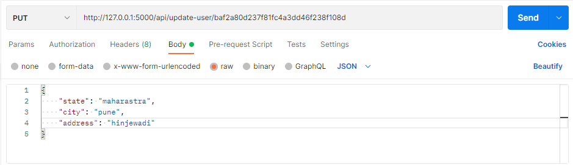

# Student-Management-System-Flask

---
## Endpoints

### 1. /api/create-user
To create a user using POST method.

The Input format for this endpoint is:

The Successful Output of this endpoint is:

If email already exist then the output is:

---

### 2. /api/get-user/<user_id>
To get an existing user by User ID using GET method.

The Input format for this endpoint is:

The Successful Output of this endpoint is:

If User ID does not exist then the output is:

---

### 3. /api/update-user/<user_id>
To update data of an existing user by User ID using PUT method.

The Input format for this endpoint is:

The Successful Output of this endpoint is:

If User ID does not exist in db then the output is:

---

### 3. /api/delete-user/<user_id>
To delete an existing user by User ID using DELETE method.

The Input format for this endpoint is:

The Successful Output of this endpoint is:

---